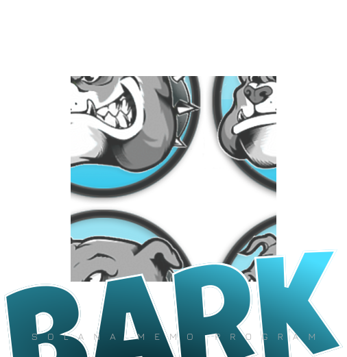

## Overview

The BARK Memo Program is a Solana program designed to enhance transaction information on the Solana blockchain. This program allows users to include custom memos with their transactions, providing additional context or references, such as notes about the transaction or associated invoice IDs.

## How it Works

The BARK Memo Program leverages Solana's custom instruction feature to add memos to transactions. When you run the program, it creates a Solana transaction and adds a memo instruction to it. This instruction includes your custom message, which is then processed by the Solana network, logging the memo on the blockchain.

## Features:

- **Custom Memos**: Easily attach custom messages to Solana transactions using the BARK Memo Program.
- **Configuration Flexibility**: Adjust program settings through a convenient configuration file.
- **Simplified Key Management**: Manage Solana keypairs effortlessly with a user-friendly JSON file.

## Getting Started

### Prerequisites

1. [Node.js](https://nodejs.org/) installed on your machine.
2. A Solana keypair for transaction signing. You can generate one using the [Solana CLI](https://docs.solana.com/cli) or use the provided `keypair.json` file.

### Installation

1. Clone this repository.

    ```bash
    git clone https://github.com/your-username/bark-memo-program.git
    ```

2. Navigate to the project directory.

    ```bash
    cd bark-memo-program
    ```

3. Install dependencies.

    ```bash
    npm install
    ```

### Configuration

Adjust the configuration settings in `config.ts` according to your needs:

```typescript
// config.ts
const config = {
  rpcUrl: 'https://api.devnet.solana.com/',
  memoProgramId: 'MemoG4JpyYsxFnatbhmjYJ4FfkQvQarc31QDJt2rKY5',
  keypairFilePath: './keypair.json',
};

export default config;
```

### Usage

1. Customize the keypair information in `keypair.json` or use your existing Solana keypair.

2. Run the application.

    ```bash
    npm start
    ```

3. The application will log a memo on the Solana blockchain.

## Directory Structure

- **src**: Contains source code files.
- **keypair.json**: Stores the Solana keypair information.
- **config.ts**: Configuration file for the Solana program.

## Additional Information

- **Solana RPC URL**: [https://api.devnet.solana.com/](https://api.devnet.solana.com/)
- **Memo Program ID**: MemoG4JpyYsxFnatbhmjYJ4FfkQvQarc31QDJt2rKY5

## Example Keypairs

For demonstration purposes, two example keypairs are included:

1. MemoG4JpyYsxFnatbhmjYJ4FfkQvQarc31QDJt2rKY5
   - Key pair JSON file: [keypairs/MemoG4JpyYsxFnatbhmjYJ4FfkQvQarc31QDJt2rKY5.json](src/keypairs/MemoG4JpyYsxFnatbhmjYJ4FfkQvQarc31QDJt2rKY5.json)

2. BARKbsY2XiJZLozPtupcXPK2YhNeNc5LW9K1cyyxwDHt
   - Key pair JSON file: [keypairs/BARKbsY2XiJZLozPtupcXPK2YhNeNc5LW9K1cyyxwDHt.json](src/keypairs/BARKbsY2XiJZLozPtupcXPK2YhNeNc5LW9K1cyyxwDHt.json)

## License

[LICENSE](LICENSE) file for details.
